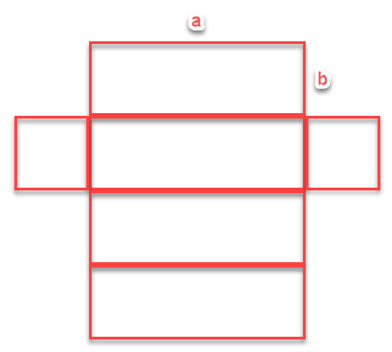

## Problema: Otimizar o custo de fabricação de uma embalagem
### Descrição:
Uma caixa com tampa deve ser construída com base quadrada, de lado $a\ cm$ tendo altura $b\ cm$.

Essa caixa deve ter volume de $2l$ e deve ter área mínima, de modo a reduzir o custo de fabricação.

O custo de fabricação obedece à seguinte relação: $$ R\$\ 0.01 \ cm^2 $$

\includegraphics{./box.png}

### Resolução:
Organizamos as dimensões da seguinte forma:

- Área do retângulo: $$ retângulo = a * b $$
- Área do quadrado: $$ quadrado = a * a \therefore quadrado = b^2 $$
- Volume: $$ volume =  2l\ (2000cm^3) = base * altura \therefore a^2*b $$

Composição de construção da caixa para formação da função box (área):
$$
box = 4 * retângulo + 2 * quadrado \therefore\\
box = 4ab + 2b^2
$$

Isolando as variáveis:
$$
  volume = areaBase * altura \therefore\\
  2000 = b^2 * a \therefore\\
  a = \frac{2000}{b^2}\\
  
\mbox{Portanto, é possível realizaz a seguinte inferência: }\\
box = 4ab+2b^2\therefore\\
box = 4b\frac{2000}{b^2} + 2b^2\\
box = 4\frac{2000}{b} + 2b^2
$$

Portanto, o custo da função pode ser exprimido por:
$$
custo = 0.01 * box \therefore\\
custo = 0.01 * 4\frac{2000}{b} + 2b^2 \therefore\\
custo = 0.02a^2+\frac{80}{a}
$$